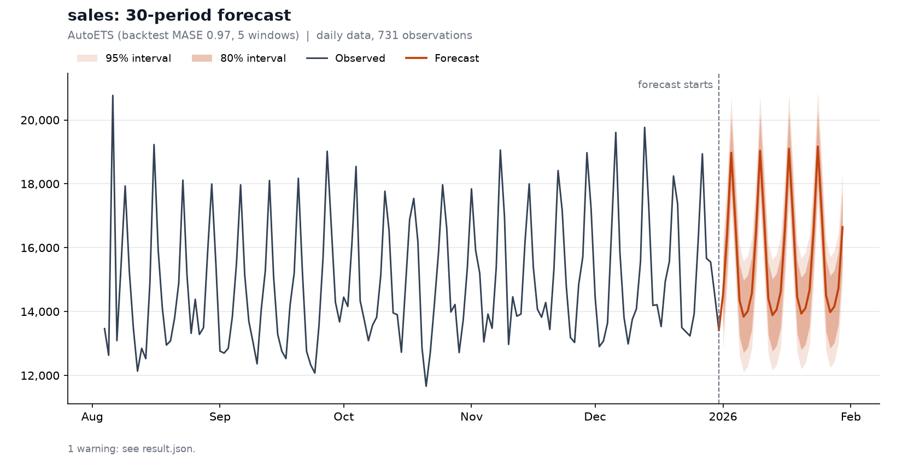

# /forecast

**Statistically backtested time-series forecasting, directly from Claude Code.**

`/forecast` is an open-source Claude Code skill that turns time-series datasets into forecasts using deterministic statistical models, rolling backtests, automatic model selection, and plain-English analysis.

<a href="https://forecast-skill.vercel.app">
  
</a>

```text
/forecast:forecast sales.csv --horizon 30
```

> **Claude understands the problem. Python does the math.**



---

## What it does

Give `/forecast` a time-series dataset:

```csv
date,sales
2026-01-01,18422
2026-01-02,19201
2026-01-03,18832
...
```

`/forecast` runs the whole forecasting workflow:

```text
Dataset
   ↓
Profile & validate
   ↓
Detect frequency / trend / seasonality
   ↓
Prepare the series
   ↓
Rolling backtests of every eligible model
   ↓
Compare forecast error
   ↓
Select a model (deterministically)
   ↓
Generate forecast + prediction intervals + chart
   ↓
Claude explains the results
```

The goal isn't to pick the most sophisticated model.

The goal is to pick the model that performs best on data it hasn't seen — and to say so plainly when nothing beats a simple baseline, or when the data can't support a forecast at all.

---

## Install

You need [Claude Code](https://claude.com/claude-code) and [`uv`](https://docs.astral.sh/uv/) (the one prerequisite; it installs Python and the dependencies for you).

```bash
brew install uv
```

(or `pip install uv`). Then, inside Claude Code:

```text
/plugin marketplace add mkaavish/forecastClaudeSkill
/plugin install forecast@forecast-skill
```

The first forecast takes about a minute while dependencies install. After that, runs take seconds.

> **Command name.** Claude Code namespaces plugin skills, so the command is `/forecast:forecast`.

---

## Usage

```text
/forecast:forecast sales.csv
/forecast:forecast sales.csv --horizon 30
/forecast:forecast revenue.csv --target revenue
/forecast:forecast demand.csv --where store=North --where product=Widget
/forecast:forecast demand.csv --agg sum
```

You can also describe what you want in words:

```text
/forecast:forecast demand.csv total units sold across all stores, next 14 days
```

| Option | What it does |
|---|---|
| `--horizon N` | Periods to forecast. Default depends on frequency (daily 28, weekly 13, monthly 12, quarterly 4). |
| `--target COL` | Column to forecast. Inferred when obvious. |
| `--date COL` | Date column. Inferred when obvious. |
| `--where COL=VALUE` | Forecast a single slice (repeatable). |
| `--agg sum\|mean` | Combine rows that share a timestamp (e.g. total across stores). |
| `--fill interpolate\|zero` | How to fill missing periods. |
| `--date-order dmy\|mdy` | Resolve ambiguous dates like `03/04/2024`. |
| `--output DIR` | Where to write result files (default `./forecast-output/<file name>/`). |

The interface is intentionally built around intelligent defaults, not dozens of required options.

---

## Example

Real output from `forecast examples/retail_sales.csv --horizon 30`:

```text
FORECAST ANALYSIS: sales

Horizon           30 daily periods (2026-01-01 to 2026-01-30)
Pattern           weekly seasonality (period 7, strength 0.82); upward trend (+54% over the history)
Model             AutoETS
Why               AutoETS had the lowest MASE (0.974) over 5 rolling backtest windows and beat the best baseline, SeasonalNaive (1.21), by 19%, more than the 5% a complex model must clear.
Backtest          MASE 0.97, MAE 593.4, sMAPE 4.0% over 5 rolling windows of 30 steps
Sum of forecasts  469,257 (+3.0% vs the previous 30 periods, 455,373)
Mean per period   15,642
Uncertainty       80% interval 13,389 to 15,656 at 2026-01-01, 15,510 to 17,779 at 2026-01-30; the interval is 1.00x as wide at the end as at the start
Intervals         native; the model's own 80% interval covered 95% of backtest actuals

Warnings
  [OUTLIERS] 9 potential outliers flagged (kept in the data).
```

Inside Claude Code you get the same facts as a short analysis that keeps three things apart: **what the data show**, **what the model forecasts**, and (optionally, clearly labelled) **possible interpretations**.

---

## Why `/forecast`?

LLMs are useful for understanding data and explaining results.

They are not forecasting engines.

`/forecast` separates those responsibilities.

### Claude

- understands the dataset and your intent
- asks when the request is ambiguous — it never guesses
- orchestrates the analysis
- explains results in plain English, separating observed facts from forecasts from interpretation

Claude never computes a statistic, never chooses the model, and never opens your data file. If it needs a number to say something true, the engine provides it.

### Python

- data validation and profiling
- frequency inference
- backtesting
- model fitting and error metrics
- model selection
- prediction intervals
- chart generation
- structured, validated output

Statistical computation is deterministic: the same input gives the same output.

---

## Model selection

`/forecast` doesn't ask Claude which model "looks best." Candidates are evaluated on historical data they haven't seen:

| Model | Why it's there |
|---|---|
| **Naive** | Baseline: "tomorrow = today". Optimal for a random walk. |
| **SeasonalNaive** | Baseline: "same as one season ago". Run when a seasonal period is found. |
| **HistoricAverage** | Baseline: the right answer for noise around a constant. |
| **AutoETS** | Exponential smoothing; strong general default for trend and seasonality. |
| **AutoTheta** | Robust and cheap; good on short series. |
| **AutoARIMA** | Captures autocorrelation structure ETS cannot. |

**The rule:** every model is scored on pooled **MASE** across rolling backtest windows. A complex model wins only if it beats the best baseline by at least **5%**; otherwise the baseline wins. Ties go to the simpler model. Nothing but the backtest numbers can change the outcome.

Complexity does not equal accuracy. If AutoARIMA loses to SeasonalNaive, SeasonalNaive wins.

### Why MASE, and why a margin?

- **MASE** is scale-free, stays defined when values are zero (sMAPE does not), and reads directly against a baseline. MAE, RMSE and sMAPE are reported alongside it.
- **The 5% margin** exists because three to five short backtest windows are noisy. On series with nothing to learn (white noise and random walks) a complex model "wins" by chance 72% of the time with no margin, versus 9% with it.

An honest note on the margin: on a 260-run synthetic benchmark scored on *held-out* data (`benchmarks/tune_margin.py`), margins from 0% to 10% were statistically indistinguishable in forecast accuracy, while always picking the baseline gave roughly 40% more held-out error. So the margin is not there to improve accuracy; it keeps the tool from claiming it found structure that is really noise, and keeps the explanation honest.

---

## Backtesting

Forecasting models are judged on their ability to predict observations they haven't seen. `/forecast` uses rolling-origin time-series cross-validation:

```text
Time ───────────────────────────────────────────▶

Window 1
[──────── TRAIN ────────][ TEST ]

Window 2
[─────────── TRAIN ─────────][ TEST ]

Window 3
[────────────── TRAIN ──────────][ TEST ]
```

- 3 to 5 windows, each as long as the forecast horizon, packed against the end of the series so the most recent behaviour is always tested.
- If history is too short to test the full horizon, the test horizon is shortened with a warning; below a floor the run refuses and tells you the longest horizon your history can support.

---

## Statistical integrity

`/forecast` is designed around a few principles, and each is enforced by tests.

- **Backtest everything.** Models earn their place on unseen data.
- **Always compare against a baseline.** A complicated model isn't automatically better.
- **Don't hide uncertainty.** Every forecast has 80% and 95% prediction intervals. If a model's own intervals contained far fewer than 80% of actuals in the backtest, they are widened (never narrowed) and the result says so.
- **Don't force forecasts.** Constant series, too little history, irregular sampling, too much missing data, or a horizon the history can't validate are *refused*, with a reason and a way forward.
- **Say when the evidence is weak.** 33 catalogued warnings — poor backtest, unstable accuracy, recent degradation, wide intervals, short history, intermittent demand, and more — each with a plain-language explanation. A test fails if any warning is emitted but uncatalogued, or catalogued but never triggered.
- **Don't confuse correlation with causation.** Claude describes patterns; it does not invent causes.
- **Don't let the LLM do the math.** Claude quotes the engine's numbers exactly. A test checks that every number in the engine's text summary appears in `result.json`.

Some behaviours worth knowing about, all measured on data with known structure:

| Series | What `/forecast` does |
|---|---|
| Trend + seasonality | A complex model wins by a wide margin; no warnings. |
| White noise | A baseline wins; one informational note. |
| Random walk | Naive wins; flagged as having little predictive skill. |
| A level shift just before the end | Flagged for recent degradation, unstable accuracy and wide intervals. |
| 70% zero demand | Baselines only, with an intermittent-demand warning. |
| Missing timestamps | The calendar is restored (otherwise the weekly pattern silently shifts); gaps are filled and reported. |

---

## Ambiguous datasets

Real datasets aren't always:

```text
date | sales
```

For example:

```text
date | store | product | units_sold | inventory | price
```

could mean total units, units by store, units by product, or store × product demand. When the data doesn't settle it, `/forecast` asks:

```text
The data has several series (by store, product). Which one should be forecast?
  * Total across everything (sum)   (--agg sum)
  * One store                       (--where store=<value>)
  * One product                     (--where product=<value>)
```

It never silently chooses. The same applies to several equally plausible target columns, several date columns, ambiguous `03/04/2024` dates, and conflicting duplicate timestamps.

---

## Outputs

A run writes to `./forecast-output/<file name>/`:

```text
forecast-output/sales/
├── result.json     everything, validated: input, profile, backtest, selection,
│                   forecast, intervals, warnings, run metadata
├── forecast.csv    series, ds, forecast, lo_80, hi_80, lo_95, hi_95, model
├── backtest.csv    one row per (model, window, step): the audit trail behind every metric
├── profile.json    the dataset profile on its own
├── forecast.png    history, forecast start, forecast, 80% and 95% intervals
└── dashboard.html  interactive dashboard (see below)
```

### The dashboard

`dashboard.html` is a self-contained page (no network access, works offline, light and dark themes, phone-friendly): the headline figures, the forecast chart with hover details and toggleable 80% / 95% bands, the model comparison and per-window error that justify the choice, the full score table, the data profile and every warning. The engine builds it from its own results, so every number on it is one the engine computed. Inside Claude Code the skill publishes it as a private Artifact and links it at the top of the answer; from the CLI, open the file in any browser.

JSON schemas for the contracts are in [`schemas/`](schemas). If the chart can't be drawn, the forecast and every other file are still written.

---

## Standalone forecasting engine

The engine works without Claude. From a clone of this repo:

```bash
bin/forecast sales.csv --horizon 30
```

or install it:

```bash
uv tool install .
forecast sales.csv --horizon 30
```

`forecast profile sales.csv` prints the dataset profile as JSON without forecasting.

| Exit code | Meaning |
|---|---|
| 0 | Forecast produced |
| 2 | Usage error |
| 3 | `needs_input`: the data supports several readings |
| 4 | `refused`: forecasting would be inappropriate, or the request is invalid |

Add `--json` to `run` to print the full result as JSON.

---

## Architecture

```text
                    /forecast:forecast sales.csv
                                │
                                ▼
                    ┌───────────────────────┐
                    │  Claude (the skill)   │  asks when ambiguous, explains results
                    └───────────┬───────────┘
                                │  bin/forecast run …   (exit 0 / 3 / 4)
                                ▼
 ┌───────────────────────── Python engine ──────────────────────────┐
 │  loading ─▶ profile ─▶ backtest ─▶ selection ─▶ forecast          │
 │  (detect,   (trend,    (rolling    (MASE +      (refit, intervals,│
 │  regularize) seasonality, windows,  5% margin,   calibration,     │
 │             outliers)   6 models)   baseline wins) clipping)      │
 │                              │                                    │
 │                  diagnostics: warnings & refusals                 │
 └──────────────────────────────┬────────────────────────────────────┘
                                ▼
          result.json · forecast.csv · backtest.csv · forecast.png
```

```text
.claude-plugin/        plugin and marketplace manifests
skills/forecast/       SKILL.md protocol + references (interpretation, model selection)
bin/forecast           launcher (runs the engine through uv)
src/forecast/          the engine
  loading.py  profile.py  backtest.py  models.py  metrics.py  selection.py
  intervals.py  diagnostics.py  pipeline.py  outputs.py  plot.py  schema.py  cli.py
schemas/               exported JSON Schemas for every contract
examples/              five synthetic datasets (+ generator)
evals/                 live skill evaluation (calls Claude; run by hand)
benchmarks/            how the selection margin was chosen
tests/                 590+ tests, including known-truth synthetic series
```

---

## Testing

```bash
uv run pytest          # everything (~2 minutes)
uv run pytest -m "not slow"   # skip the model-fitting tests
```

Because this software produces statistical results, the tests check behaviour, not just that it runs. Seeded synthetic series with known structure (trend, seasonality, noise, random walks, level shifts, zero-heavy demand, missing data) verify that, for example, a seasonal baseline wins on clean seasonal data, a baseline wins on noise, constant series are refused, and prediction intervals cover roughly what they claim.

The skill itself is tested too: structure tests (every warning and refusal code has plain-language guidance; the references match the engine's constants) and a live harness, `evals/run_skill_evals.py`, that drives real Claude sessions and checks that the raw data is never read, ambiguity is asked rather than guessed, and every number in the answer comes from `result.json`.

---

## Example datasets

Synthetic and seeded; no external data. Regenerate with `python examples/make_examples.py`.

| File | Situation |
|---|---|
| `retail_sales.csv` | Daily sales: weekend peaks, growth, promotion spikes. A complex model wins. |
| `saas_revenue.csv` | Monthly revenue with steady growth, 60 months. Few backtest windows; intervals get widened. |
| `website_traffic.csv` | Wandering level, weak weekly pattern, viral spikes. A baseline wins, with warnings. |
| `inventory_demand.csv` | Slow-moving item, ~70% zero days. Baselines only. |
| `multi_store_sales.csv` | Stores × products. `/forecast` asks which series. |

---

## Tech stack

- **Agent layer:** Claude Code plugin and skill
- **Forecasting:** [StatsForecast](https://github.com/Nixtla/statsforecast), pandas, NumPy, SciPy, statsmodels
- **Contracts:** pydantic
- **Visualization:** Matplotlib
- **Testing / tooling:** pytest, ruff, uv, GitHub Actions

Everything runs locally. No accounts, no hosted backend, no paid API.

---

## Status

**v0.2.0.**

- [x] Claude Code `/forecast` skill
- [x] CSV ingestion, date / target / frequency detection
- [x] Data-quality validation and profiling
- [x] Naive, SeasonalNaive and HistoricAverage baselines
- [x] AutoETS, AutoTheta, AutoARIMA
- [x] Rolling-origin backtesting
- [x] MAE / RMSE / sMAPE / MASE evaluation
- [x] Deterministic model selection
- [x] Prediction intervals with backtest-based widening
- [x] Forecast chart, interactive dashboard, `forecast.csv`, `result.json`
- [x] Plain-English analysis
- [x] Standalone Python CLI
- [x] Automated tests and synthetic example datasets

Known limits of V1: one series per run; one seasonal period (the shortest significant one); no holidays, promotions or external regressors; no intermittent-demand models (zero-heavy data gets baselines only); no interval for the *sum* of a forecast (per-step errors are correlated); results are only as good as the history is representative.

---

## Roadmap

Future versions may explore:

- grouped and multiple time series
- hierarchical forecasting and reconciliation
- intermittent-demand models
- multiple seasonality
- changepoint and anomaly detection
- holiday and event effects, external regressors
- Excel, Parquet and SQL sources
- batch forecasting
- additional statistical and ML models
- interactive charts
- natural-language questions about results

The focus for V1 is intentionally smaller:

> **Make one time-series forecast correctly and explain it well.**

---

## Contributing

`/forecast` is early and contributions are welcome: issues, bug reports, forecasting edge cases, model suggestions, documentation, and pull requests.

When proposing a new forecasting model, the question shouldn't simply be:

> "Is this model more advanced?"

It should be:

> **"Does this improve forecasting performance or support a use case the existing models cannot handle?"**

Every model in the registry states why it exists; a new one should too, and should show held-out evidence (see `benchmarks/`).

---

## Documentation

<a href="https://forecast-skill.vercel.app">
  
</a>

Design decisions, measurements and trade-offs are recorded in [`docs/decisions.md`](docs/decisions.md); the original plan is [`plan.md`](plan.md).

---

## License

MIT

---

<p align="center">
  <strong>/forecast</strong>
  <br>
  <em>Claude understands the problem. Python does the math.</em>
</p>
